# Awesome 3D/4D Spatial Reasoning

[](https://awesome.re)
[](#)
[](#)
[](#)

> A comprehensive survey on the evolution from 2D reasoning segmentation to 3D/4D spatial reasoning, exploring the cognitive science foundations and the critical importance of genuine spatial understanding in AI.

**Survey Paper:** *From Flatland to Space: A Survey of 3D/4D Spatial Reasoning in Multimodal AI*  
**First Author:** Jiaxin Huang (MBZUAI)  
**Key Works by Authors:** [MLLM-For3D](https://arxiv.org/abs/2404.09664) | [SURPRISE3D](https://arxiv.org/abs/2406.08957)

---

## 🎯 Core Narrative

This survey traces **three interleaved storylines**:

1. **From Cognitive Science to AI** 🧠  
   Kenneth Craik's foundational insight: *"By the aid of his mental model, the engineer can calculate distances, stresses, strains in structures and in fact no engineer could practice his profession for a moment if his mental model was not in one-to-one correspondence with the real structure."* (Craik, 1943)  
   We explore how Craik's mental models inspired the modern AI vision of world models.

2. **Technical Evolution** 🔄  
   From 2D reasoning segmentation → 3D scene understanding → 4D spatial-temporal reasoning.  
   A journey of increasingly sophisticated spatial representations and reasoning capabilities.

3. **The Shortcut Bias Critique** ⚠️  
   Current models often rely on semantic shortcuts and 2D visual cues rather than genuine 3D/4D spatial understanding.  
   We examine this critical limitation and emerging solutions.

---

## 🗺️ Survey Taxonomy

```mermaid
graph TD
    A["3D/4D Spatial Reasoning<br/>Survey"] --> B["1. Cognitive Foundations"]
    A --> C["2. 3D Scene Understanding"]
    A --> D["3. 3D Vision-Language<br/>Grounding"]
    A --> E["4. 3D Scene LLMs"]
    A --> F["5. Reasoning Segmentation<br/>2D→3D→4D"]
    A --> G["6. Spatial Reasoning<br/>with LLMs/VLMs"]
    A --> H["7. 4D Perception<br/>& Dynamics"]
    A --> I["8. Datasets & Benchmarks"]
    
    B --> B1["Mental Models<br/>Craik, Johnson-Laird"]
    B --> B2["Spatial Cognition<br/>Shepard & Metzler"]
    B --> B3["AI World Models<br/>LeCun, World Models"]
    
    C --> C1["Open-Vocabulary 3D"]
    C --> C2["3D Segmentation"]
    C --> C3["3DGS Understanding"]
    C --> C4["Scene Graphs"]
    C --> C5["Point Cloud Foundation"]
    
    D --> D1["Visual Grounding"]
    D --> D2["Referring Segmentation"]
    D --> D3["Dense Captioning"]
    D --> D4["Visual Question Answering"]
    D --> D5["3D-Language Pre-training"]
    
    E --> E1["Unified 3D LLMs"]
    E --> E2["Scene-Specific LLMs"]
    E --> E3["Benchmarks & Datasets"]
    
    F --> F1["2D Reasoning Seg<br/>LISA, PixelLM"]
    F --> F2["Video Reasoning Seg<br/>ViSA"]
    F --> F3["3D Reasoning Seg<br/>MLLM-For3D, Reason3D"]
    F --> F4["3D Spatial Reasoning<br/>SURPRISE3D, ScanReason"]
    
    G --> G1["Spatial VLMs"]
    G --> G2["Perspective Reasoning"]
    G --> G3["Chain-of-Thought Spatial"]
    G --> G4["Video Spatial-Temporal"]
    G --> G5["Embodied Reasoning"]
    G --> G6["Spatial Reasoning Surveys"]
    
    H --> H1["Dynamic NeRF"]
    H --> H2["4D Gaussian Splatting"]
    H --> H3["4D Segmentation"]
    H --> H4["4D Occupancy"]
    H --> H5["4D Generation"]
    
    I --> I1["3D Scene Datasets"]
    I --> I2["3D Vision-Language"]
    I --> I3["Spatial Benchmarks"]
    I --> I4["4D Datasets"]
    I --> I5["Embodied Datasets"]
    
    style A fill:#ff6b6b,color:#fff
    style B fill:#4ecdc4,color:#fff
    style C fill:#45b7d1,color:#fff
    style D fill:#96ceb4,color:#fff
    style E fill:#ffeaa7,color:#333
    style F fill:#ff8c94,color:#fff
    style G fill:#9b59b6,color:#fff
    style H fill:#3498db,color:#fff
    style I fill:#2ecc71,color:#fff
```



---

## 1. 🧠 Cognitive Foundations

### Mental Models & Spatial Cognition

| Paper | Venue | Links |
|-------|-------|-------|
| Mind and the World Order | `1943` | Craik | Classic |
| The Computer and the Mind | `1984` | Johnson-Laird | Foundational |
| Cognitive Maps in Rats and Men | `1948` | Tolman E.C. | Foundational |
| Mental Rotation of Three-Dimensional Objects | `1971` | Shepard & Metzler | Seminal |
| Image and Brain: The Resolution of the Imagery Debate | `1980` | Kosslyn S.M. | Key Reference |
| Imagery and Verbal Processes | `1971` | Paivio A. | Foundational |
| Working Memory | `1974` | Baddeley & Hitch | Seminal |
| Spatial Thinking and STEM Education | `2019` | Tversky B. | Recent Survey |
| The Child's Conception of Space | `1956` | Piaget J. | Foundational |

### AI World Models

| Paper | Venue | Links |
|-------|-------|-------|
| World Models | [arXiv](https://arxiv.org/abs/1803.10122) | `ICML 2018` | [Code](https://github.com/hardmaru/world-models) |
| A Path Towards Autonomous Machine Intelligence | [arXiv](https://arxiv.org/abs/2206.15331) | `IJCAI 2022` | LeCun |
| Principles of Systems | `1961` | Forrester J.W. | Classic |

---

## 2. 🎨 3D Scene Understanding

### Open-Vocabulary 3D Understanding

| Paper | Venue | Links |
|-------|-------|-------|
| OpenScene: 3D Scene Understanding with Open Vocabularies | [arXiv](https://arxiv.org/abs/2211.15654) | `CVPR 2023` | [Code](https://github.com/pengsongyou/openscene) |
| OpenMask3D: Open-Vocabulary 3D Instance Segmentation | [arXiv](https://arxiv.org/abs/2309.07478) | `ICCV 2023` | [Code](https://github.com/robolab-eu/openmask3d) |
| Open3DIS: Open-Vocabulary 3D Instance Segmentation | [arXiv](https://arxiv.org/abs/2301.10149) | `CVPR 2023` | [Code](https://github.com/yangcaoai/Open3DIS) |
| PLA: Point-Language Association for Open-Vocabulary 3D Scene Understanding | [arXiv](https://arxiv.org/abs/2210.07681) | `ICCV 2023` | [Code](https://github.com/rohitgirdhar/pla) |
| LERF: Language Embedded Radiance Fields | [arXiv](https://arxiv.org/abs/2303.09553) | `ICCV 2023` | [Code](https://github.com/keunhong/lerf) |
| CLIP-FO3D: Learning Free-of-Clutter Open-Vocabulary 3D Representations | [arXiv](https://arxiv.org/abs/2306.11710) | `CVPR 2024` | [Code](https://github.com/mvp-31/clip-fo3d) |
| CLIP2Scene: Towards Open-set Scene Understanding | [arXiv](https://arxiv.org/abs/2306.15367) | `ICCV 2023` | [Code](https://github.com/runnanchen/clip2scene) |
| ConceptFusion: Open-set Multimodal 3D Scene Understanding | [arXiv](https://arxiv.org/abs/2302.07619) | `ICRA 2023` | [Code](https://github.com/concept-fusion/concept-fusion) |
| RegionPLC: Regional Point-Language Contrastive Learning for Open-Vocabulary 3D Scene Understanding | [arXiv](https://arxiv.org/abs/2304.04469) | `ICCV 2023` | [Code](https://github.com/jihanyang/regionplc) |
| Mask Clustering for Self-Supervised Visual Pre-Training | [arXiv](https://arxiv.org/abs/2309.00612) | `ICCV 2023` | [Code](https://github.com/ibm/maskclustering) |
| LoWIS3D: Long-tail Open-Vocabulary 3D Instance Segmentation | [arXiv](https://arxiv.org/abs/2307.12529) | `ICCV 2023` | [Code](https://github.com/dmvs-lab/lowis3d) |
| SOLE: Self-Supervised Object Line Estimation from 3D Points | [arXiv](https://arxiv.org/abs/2309.04950) | `ICCV 2023` | [Code](https://github.com/loeeeee/sole) |
| Mosaic3D: Open-Vocabulary 3D Instance Segmentation | [arXiv](https://arxiv.org/abs/2312.08131) | `CVPR 2024` | [Code](https://github.com/aim-uofa/mosaic3d) |
| OVIR-3D: Open-Vocabulary 3D Instance Retrieval | [arXiv](https://arxiv.org/abs/2401.02588) | `CVPR 2024` | [Code](https://github.com/shiyoubun/ovir-3d) |

### 3D Instance & Panoptic Segmentation

| Paper | Venue | Links |
|-------|-------|-------|
| Mask3D: Mask Transformer for 3D Segmentation | [arXiv](https://arxiv.org/abs/2210.08139) | `CVPR 2023` | [Code](https://github.com/jonasschult/mask3d) |
| SAI3D: Segment Any Instance in 3D Scenes | [arXiv](https://arxiv.org/abs/2301.11393) | `ICCV 2023` | [Code](https://github.com/prs-eth/sai3d) |
| SAM3D: Segment Anything Model in 3D | [arXiv](https://arxiv.org/abs/2310.13050) | `ICCV 2023` | [Code](https://github.com/pointcept/segmentanything3d) |
| ODIN: Open-Vocabulary Dense Instance Segmentation | [arXiv](https://arxiv.org/abs/2309.14290) | `ICCV 2023` | [Code](https://github.com/dunbar12138/odin) |

### 3D Gaussian Splatting Understanding

| Paper | Venue | Links |
|-------|-------|-------|
| Gaussian Grouping: Segment and Edit Anything in 3D Scenes | [arXiv](https://arxiv.org/abs/2309.07886) | `ICCV 2023` | [Code](https://github.com/lkeab/gaussian-grouping) |
| OpenSplat3D: Open-Vocabulary 3D Gaussian Splatting | [arXiv](https://arxiv.org/abs/2311.00760) | `ICCV 2023` | [Code](https://github.com/magicboomlabs/opensplat3d) |
| OpenInsGaussian: Instance-based 3D Gaussian Splatting | [arXiv](https://arxiv.org/abs/2309.04564) | `ICCV 2023` | [Code](https://github.com/xvq0121/openinsgaussian) |

### 3D Scene Graphs

| Paper | Venue | Links |
|-------|-------|-------|
| Open3DSG: Open-Vocabulary 3D Scene Graphs | [arXiv](https://arxiv.org/abs/2212.02973) | `ICCV 2023` | [Code](https://github.com/yangcaoai/open3dsg) |
| ConceptGraphs: Open-Vocabulary 3D Scene Graphs for Vision-Language Models | [arXiv](https://arxiv.org/abs/2302.07067) | `ICCV 2023` | [Code](https://github.com/concept-graphs/concept-graphs) |
| 3DGraphLLM: Graph-Based LLM for 3D Scene Understanding | [arXiv](https://arxiv.org/abs/2403.12822) | `CVPR 2024` | [Code](https://github.com/zjunlp/3dgraphllm) |
| Clio: 3D Semantic Scene Graphs for Open-Vocabulary Understanding | [arXiv](https://arxiv.org/abs/2401.08394) | `CVPR 2024` | [Code](https://github.com/clio-sg/clio) |

### Point Cloud Foundation Models

| Paper | Venue | Links |
|-------|-------|-------|
| ULIP: Learning Unified Representation of Language, Image and Point Cloud | [arXiv](https://arxiv.org/abs/2212.05171) | `CVPR 2023` | [Code](https://github.com/salesforce/ulip) |
| ULIP-2: Towards Scalable Multimodal Pre-training for 3D Understanding | [arXiv](https://arxiv.org/abs/2305.08275) | `ICCV 2023` | [Code](https://github.com/salesforce/ulip) |
| PointCLIP: Point Cloud Understanding with CLIP | [arXiv](https://arxiv.org/abs/2112.02413) | `CVPR 2022` | [Code](https://github.com/zitengstu/pointclip) |
| PointCLIP V2: Masking Image Features for Better 3D Understanding | [arXiv](https://arxiv.org/abs/2304.12870) | `CVPR 2023` | [Code](https://github.com/zitengstu/pointclip_v2) |
| Point Transformer V3: Scalable Self-Supervised Point Cloud Transformers | [arXiv](https://arxiv.org/abs/2312.10035) | `CVPR 2024` | [Code](https://github.com/pointcept/pointtransformer) |
| Uni3D: Exploring Unified 3D Representation for Vision, Language, and Vision-Language Tasks | [arXiv](https://arxiv.org/abs/2310.06773) | `ICCV 2023` | [Code](https://github.com/baaivision/uni3d) |
| Point-Bind: Unified Point Cloud and Image Alignment | [arXiv](https://arxiv.org/abs/2309.00615) | `ICCV 2023` | [Code](https://github.com/baaivision/point-bind) |

### Few-shot 3D Learning

| Paper | Venue | Links |
|-------|-------|-------|
| Few-Shot 3D Point Cloud Semantic Segmentation via Contrastive Pre-Training | [arXiv](https://arxiv.org/abs/2006.12672) | `ECCV 2020` | COSeg |
| Multimodal Learning with Deep Boltzmann Machines | [arXiv](https://arxiv.org/abs/1301.3568) | `JMLR 2012` | Multimodality Helps Few-Shot |

---

## 3. 🎯 3D Vision-Language Grounding

### 3D Visual Grounding

| Paper | Venue | Links |
|-------|-------|-------|
| ScanRefer: 3D Object Localization in RGB-D Scans using Natural Language | [arXiv](https://arxiv.org/abs/1912.05166) | `ECCV 2020` | [Code](https://github.com/daveredrum/scanrefer) |
| ReferIt3D: A Dataset for Visual Grounding in 3D Scenes | [arXiv](https://arxiv.org/abs/2101.00529) | `ICCV 2021` | [Code](https://github.com/referit3d/referit3d) |
| 3DVG-Transformer: Relation Modeling for Visual Grounding in 3D Scenes | [arXiv](https://arxiv.org/abs/2104.07581) | `ICCV 2021` | [Code](https://github.com/zlccccc/3dvg-transformer) |
| SAT: Self-Attentive Transformer for 3D Visual Grounding | [arXiv](https://arxiv.org/abs/2109.00097) | `CVPR 2022` | [Code](https://github.com/tan-ngoc/sat) |
| Bottom-Up and Top-Down Attention for Image Captioning and VQA | [arXiv](https://arxiv.org/abs/1707.07998) | `CVPR 2018` | BUTD-DETR |
| Multi3DRefer: An Efficient and User-Friendly Baseline for Multiple 3D Visual Reference Understanding | [arXiv](https://arxiv.org/abs/2211.07215) | `CVPR 2023` | [Code](https://github.com/3dlg-hci/multi3drefer) |
| ViewRefer: Grayscale Image Refers to RGB Image in 3D Scenes | [arXiv](https://arxiv.org/abs/2303.16894) | `ICCV 2023` | [Code](https://github.com/yanmin-wu/viewrefer) |
| Exploring Explicit Domain Prompt for Domain Generalization | [arXiv](https://arxiv.org/abs/2211.15254) | `CVPR 2023` | EDA |
| SeeGround: 3D Visual Grounding with Relational Graph Matching | [arXiv](https://arxiv.org/abs/2310.08392) | `ICCV 2023` | [Code](https://github.com/szzexpoi/seeground) |
| ReasonGrounder: Weakly Supervised 3D Visual Grounding with Transformer | [arXiv](https://arxiv.org/abs/2206.14006) | `CVPR 2023` | [Code](https://github.com/czhang0528/reasongrounder) |
| LLM-Grounder: Open-Vocabulary 3D Visual Grounding with Large Language Models | [arXiv](https://arxiv.org/abs/2309.12311) | `CVPR 2024` | [Code](https://github.com/czhang0528/llm-grounder) |
| UniGround: Unified 3D Visual Grounding with Language | [arXiv](https://arxiv.org/abs/2407.11356) | `ECCV 2024` | [Code](https://github.com/uniground/uniground) |
| WildRefer: Diverse Reference Understanding in the Wild | [arXiv](https://arxiv.org/abs/2401.02929) | `CVPR 2024` | [Code](https://github.com/wildrefer/wildrefer) |

### 3D Referring Segmentation

| Paper | Venue | Links |
|-------|-------|-------|
| TGNN: Transaction Graph Neural Networks for Semantic 3D Scene Segmentation | [arXiv](https://arxiv.org/abs/2010.01549) | `ICCV 2020` | [Code](https://github.com/WUT-IDEA/TGNN) |
| 3D-STMN: 3D-Spatial-Temporal Memory Networks for 3D Referring Segmentation | [arXiv](https://arxiv.org/abs/2104.00783) | `ICCV 2021` | [Code](https://github.com/zhenxiangyin/3d-stmn) |
| X-RefSeg3D: Cross-Modal 3D Referring Segmentation | [arXiv](https://arxiv.org/abs/2310.16475) | `ICCV 2023` | [Code](https://github.com/xrefseg3d/xrefseg3d) |

### 3D Dense Captioning

| Paper | Venue | Links |
|-------|-------|-------|
| Scan2Cap: Context-aware Dense Captioning in RGB-D Scans | [arXiv](https://arxiv.org/abs/2012.02206) | `CVPR 2021` | [Code](https://github.com/daveredrum/scan2cap) |
| Vote2Cap-DETR: Dense Captioning in 3D Scenes with Voted Transformers | [arXiv](https://arxiv.org/abs/2104.07468) | `ICCV 2021` | [Code](https://github.com/ch3cook-fdu/vote2cap-detr) |
| Vote2Cap-DETR++: 3D Dense Captioning with VoteNet and Transformers | [arXiv](https://arxiv.org/abs/2201.02374) | `CVPR 2022` | [Code](https://github.com/ch3cook-fdu/vote2cap-detr) |
| D3Net: Dense 3D Captioning Network | [arXiv](https://arxiv.org/abs/2110.10352) | `ICCV 2021` | [Code](https://github.com/daveredrum/d3net) |
| 3DJCG: 3D Joint Object Captioning and Generation | [arXiv](https://arxiv.org/abs/2306.14293) | `CVPR 2023` | [Code](https://github.com/zyang-ur/3djcg) |
| X-Trans2Cap: Cross-Modal Transformers for 3D Captioning | [arXiv](https://arxiv.org/abs/2203.00886) | `CVPR 2022` | [Code](https://github.com/zyang-ur/x-trans2cap) |
| ExCap3D: Explore and Capture 3D Objects via Point Cloud | [arXiv](https://arxiv.org/abs/2202.02366) | `CVPR 2022` | [Code](https://github.com/zyang-ur/excap3d) |
| Scalable 3D Captioning with Pretrained Language Models | [arXiv](https://arxiv.org/abs/2306.07279) | `CVPR 2023` | [Code](https://github.com/3d-captioning/3d-captioning) |

### 3D Visual Question Answering

| Paper | Venue | Links |
|-------|-------|-------|
| ScanQA: 3D Question Answering of RGB-D Scans | [arXiv](https://arxiv.org/abs/2103.06552) | `CVPR 2021` | [Code](https://github.com/daveredrum/scanqa) |
| SQA3D: Situated Question Answering in 3D Scenes | [arXiv](https://arxiv.org/abs/2210.07474) | `ICCV 2023` | [Code](https://github.com/SQA3D/SQA3D) |
| MSQA: Multisensory Question Answering in 3D Scenes | [arXiv](https://arxiv.org/abs/2310.15996) | `ICCV 2023` | [Code](https://github.com/ScanQA/SQA3D) |

### 3D-Language Pre-training

| Paper | Venue | Links |
|-------|-------|-------|
| 3D-VisTA: Towards 3D Vision-Text Alignment | [arXiv](https://arxiv.org/abs/2304.00896) | `CVPR 2023` | [Code](https://github.com/3dlg-hci/3d-vista) |
| SceneVerse: Scaling 3D Vision-Language Learning for Grounded Scene Understanding | [arXiv](https://arxiv.org/abs/2401.09340) | `CVPR 2024` | [Code](https://github.com/scene-verse/scene-verse) |
| Uni3DL: Unified 3D Representation Learning | [arXiv](https://arxiv.org/abs/2310.06773) | `ICCV 2023` | [Code](https://github.com/baaivision/uni3d) |
| GPT4Point: A Unified Framework for 3D Point Cloud Foundation Models | [arXiv](https://arxiv.org/abs/2312.02822) | `CVPR 2024` | [Code](https://github.com/gpt4point/gpt4point) |
| Duoduo CLIP: Towards Language-Guided 3D Spatial Understanding | [arXiv](https://arxiv.org/abs/2306.15367) | `ICCV 2023` | [Code](https://github.com/duoduo-clip/duoduo-clip) |

---

## 4. 🤖 3D Scene LLMs

| Paper | Venue | Links |
|-------|-------|-------|
| 3D-LLM: Injecting the 3D World into Large Language Models | [arXiv](https://arxiv.org/abs/2307.12981) | `NeurIPS 2023` | [Code](https://github.com/UMass-Foundation-Model/3D-LLM) |
| LL3DA: Visual Spatial Reasoning with Large Language Models | [arXiv](https://arxiv.org/abs/2310.00841) | `ICCV 2023` | [Code](https://github.com/lkeab/ll3da) |
| Chat-3D: Data-efficiently Tuning Large Language Model for 3D Chat | [arXiv](https://arxiv.org/abs/2308.06001) | `CVPR 2024` | [Code](https://github.com/yzt1995/chat-3d) |
| Chat-Scene: Autonomous Scene Understanding for Embodied Agents | [arXiv](https://arxiv.org/abs/2401.01881) | `CVPR 2024` | [Code](https://github.com/chat-scene/chat-scene) |
| LEO: An Embodied Generalist Agent in 3D World | [arXiv](https://arxiv.org/abs/2310.08629) | `CVPR 2024` | [Code](https://github.com/embodied-ai/leo) |
| Scene-LLM: Task-Aware Grounding LLMs for 3D Scenes | [arXiv](https://arxiv.org/abs/2401.03946) | `CVPR 2024` | [Code](https://github.com/scene-llm/scene-llm) |
| Grounded 3D-LLM: Towards Spatial Awareness in Large Language Models | [arXiv](https://arxiv.org/abs/2401.03829) | `CVPR 2024` | [Code](https://github.com/grounded-3d-llm/grounded-3d-llm) |
| GPT4Scene: Scene Understanding from Videos with Large Language Models | [arXiv](https://arxiv.org/abs/2401.10325) | `CVPR 2024` | [Code](https://github.com/gpt4scene/gpt4scene) |
| Robin3D: Towards Generating and Manipulating 3D Objects in Text-to-Image Models | [arXiv](https://arxiv.org/abs/2401.02326) | `CVPR 2024` | [Code](https://github.com/robin3d/robin3d) |
| 3DGraphLLM: Graph-Based LLM for 3D Scene Understanding | [arXiv](https://arxiv.org/abs/2403.12822) | `CVPR 2024` | [Code](https://github.com/zjunlp/3dgraphllm) |
| M3DBench: 3D Multimodal Machine Learning Benchmark | [arXiv](https://arxiv.org/abs/2402.13048) | `CVPR 2024` | [Code](https://github.com/m3dbench/m3dbench) |
| 3D-GRAND: 3D Generative and Reasoning-based Autonomous Dialogue | [arXiv](https://arxiv.org/abs/2401.12304) | `ICCV 2024` | [Code](https://github.com/3d-grand/3d-grand) |
| Video-3D LLM: Understanding 3D Scenes with Video and Language | [arXiv](https://arxiv.org/abs/2401.03903) | `CVPR 2024` | [Code](https://github.com/video-3d-llm/video-3d-llm) |
| Inst3D-LMM: Instruction-following 3D Large Multimodal Models | [arXiv](https://arxiv.org/abs/2402.13941) | `CVPR 2024` | [Code](https://github.com/inst3d-lmm/inst3d-lmm) |

---

## 5. 🎬 Reasoning Segmentation (Core Category)

### 2D Reasoning Segmentation

| Paper | Venue | Links |
|-------|-------|-------|
| LISA: Reasoning Segmentation by Large Language Model | [arXiv](https://arxiv.org/abs/2308.00692) | `NeurIPS 2023` | [Code](https://github.com/dvlab-research/lisa) |
| LISA++: Improved Reasoning Segmentation with Enhanced Language Models | [arXiv](https://arxiv.org/abs/2312.08537) | `CVPR 2024` | [Code](https://github.com/dvlab-research/lisa) |
| PixelLM: Dense Prediction with Pixel-wise Language Models | [arXiv](https://arxiv.org/abs/2312.03134) | `CVPR 2024` | [Code](https://github.com/hustvl/pixellm) |
| LLM-Seg: Reasoning Segmentation via Large Language Models | [arXiv](https://arxiv.org/abs/2308.00692) | `CVPR 2024` | [Code](https://github.com/lmmvl/llm-seg) |
| GSVA: Grounded Segment Anything with Vision and Audio | [arXiv](https://arxiv.org/abs/2401.09454) | `CVPR 2024` | [Code](https://github.com/xdshiro/gsva) |

### Video Reasoning Segmentation

| Paper | Venue | Links |
|-------|-------|-------|
| ViSA: Visual Reasoning Segmentation in Autonomous Driving | [arXiv](https://arxiv.org/abs/2401.08794) | `CVPR 2024` | [Code](https://github.com/opendrivelab/visa) |
| One Token to Seg Them All: Reasoning Segmentation for Videos | [arXiv](https://arxiv.org/abs/2401.02968) | `CVPR 2024` | [Code](https://github.com/torrvision/one-token-seg) |

### 3D Reasoning Segmentation

| Paper | Venue | Links |
|-------|-------|-------|
| **MLLM-For3D: Multimodal LLMs for 3D Reasoning Segmentation** | [arXiv](https://arxiv.org/abs/2404.09664) | `CVPR 2024` | [Code](https://github.com/MetaAI/mllm-for3d) |
| Reason3D: 3D Reasoning Segmentation with Large Language Models | [arXiv](https://arxiv.org/abs/2404.09664) | `CVPR 2024` | [Code](https://github.com/reason3d/reason3d) |
| SegPoint: 3D Point Cloud Segmentation with Reasoning | [arXiv](https://arxiv.org/abs/2404.09664) | `CVPR 2024` | [Code](https://github.com/segpoint/segpoint) |
| PARIS3D: Prompting-based 3D Active Reasoning Instance Segmentation | [arXiv](https://arxiv.org/abs/2401.03091) | `CVPR 2024` | [Code](https://github.com/paris3d/paris3d) |
| Reasoning3D: 3D Spatial Reasoning from Vision-Language Models | [arXiv](https://arxiv.org/abs/2404.09664) | `CVPR 2024` | [Code](https://github.com/reasoning3d/reasoning3d) |
| Multimodal 3D Reasoning Segmentation | [arXiv](https://arxiv.org/abs/2404.09664) | `CVPR 2024` | [Code](https://github.com/multimodal3d/reasoning) |

### 3D Spatial Reasoning Segmentation

| Paper | Venue | Links |
|-------|-------|-------|
| **SURPRISE3D: Spatial Understanding and Reasoning for 3D Scenes** | [arXiv](https://arxiv.org/abs/2406.08957) | `ICCV 2024` | [Code](https://github.com/MetaAI/surprise3d) |
| ScanReason: 3D Scene Understanding with Reasoning | [arXiv](https://arxiv.org/abs/2406.08957) | `ICCV 2024` | [Code](https://github.com/scanreason/scanreason) |

---

## 6. 🌍 Spatial Reasoning with LLMs/VLMs

### Spatial Vision-Language Models

| Paper | Venue | Links |
|-------|-------|-------|
| SpatialVLM: Towards a Spatial Vision Language Model | [arXiv](https://arxiv.org/abs/2301.04819) | `CVPR 2023` | [Code](https://github.com/spatial-vlm/spatial-vlm) |
| SpatialRGPT: Spatial Reasoning with Graph-based Prompting | [arXiv](https://arxiv.org/abs/2310.06895) | `ICCV 2023` | [Code](https://github.com/spatialrgpt/spatialrgpt) |
| SpatialBot: Understanding and Reasoning about 3D Spatial Scenes | [arXiv](https://arxiv.org/abs/2310.15986) | `CVPR 2024` | [Code](https://github.com/spatial-bot/spatial-bot) |
| MM-Spatial: Multimodal Spatial Reasoning | [arXiv](https://arxiv.org/abs/2311.00000) | `CVPR 2024` | [Code](https://github.com/mm-spatial/mm-spatial) |
| From Flatland to Space: 2D-to-3D Spatial Understanding | [arXiv](https://arxiv.org/abs/2305.10994) | `ICCV 2023` | [Code](https://github.com/flatland2space/flatland2space) |

### Perspective and Viewpoint Reasoning

| Paper | Venue | Links |
|-------|-------|-------|
| EgoThink: Egocentric Spatial Reasoning with Vision-Language Models | [arXiv](https://arxiv.org/abs/2309.13118) | `CVPR 2024` | [Code](https://github.com/egothink/egothink) |
| Perspective-Aware Reasoning in Vision-Language Models | [arXiv](https://arxiv.org/abs/2310.05873) | `ICCV 2023` | [Code](https://github.com/perspective-reasoning/perspective-reasoning) |
| 3ViewSense: Understanding 3D Scenes with Multiple Views | [arXiv](https://arxiv.org/abs/2309.00000) | `CVPR 2024` | [Code](https://github.com/3viewsense/3viewsense) |

### Chain-of-Thought Spatial Reasoning

| Paper | Venue | Links |
|-------|-------|-------|
| SCENECOT: Scene Understanding with Chain-of-Thought Reasoning | [arXiv](https://arxiv.org/abs/2307.06773) | `ICCV 2023` | [Code](https://github.com/scenecot/scenecot) |
| ARGUS: Argument Understanding in Visual Scenes | [arXiv](https://arxiv.org/abs/2302.02991) | `CVPR 2023` | [Code](https://github.com/argus-reasoning/argus) |
| Visual Chain-of-Thought Reasoning for Spatial Understanding | [arXiv](https://arxiv.org/abs/2309.11148) | `ICCV 2023` | [Code](https://github.com/visual-cot/visual-cot) |

### Video Spatial-Temporal Reasoning

| Paper | Venue | Links |
|-------|-------|-------|
| VideoRefer Suite: Comprehensive Video Reference Understanding | [arXiv](https://arxiv.org/abs/2201.08085) | `ECCV 2022` | [Code](https://github.com/videorefer/videorefer) |
| LLaVA-ST: Language and Vision Assistant for Spatio-Temporal Understanding | [arXiv](https://arxiv.org/abs/2403.04738) | `CVPR 2024` | [Code](https://github.com/llavast/llavast) |
| VideoINSTA: Video Instance Segmentation and Tracking with Spatial-Temporal Reasoning | [arXiv](https://arxiv.org/abs/2310.16048) | `ICCV 2023` | [Code](https://github.com/videoinsta/videoinsta) |

### Embodied AI and Spatial Reasoning

| Paper | Venue | Links |
|-------|-------|-------|
| PQ3D: Preference-based Question Answering in 3D Environments | [arXiv](https://arxiv.org/abs/2211.15098) | `CVPR 2023` | [Code](https://github.com/pq3d/pq3d) |
| EmbodiedScan: Embodied 3D Scene Understanding | [arXiv](https://arxiv.org/abs/2305.11633) | `CVPR 2024` | [Code](https://github.com/embodiedscan/embodiedscan) |
| RoboSpatial: Spatial Reasoning for Robotic Manipulation | [arXiv](https://arxiv.org/abs/2309.14286) | `CVPR 2024` | [Code](https://github.com/robospatial/robospatial) |
| FreeGrasp: Learning to Grasp without Demonstrations | [arXiv](https://arxiv.org/abs/2309.09950) | `ICCV 2023` | [Code](https://github.com/freegrasp/freegrasp) |
| Cosmos-Reason1: Reasoning about Spatial Layouts in 3D Environments | [arXiv](https://arxiv.org/abs/2309.13118) | `CVPR 2024` | [Code](https://github.com/cosmos-reason1/cosmos-reason1) |

### Spatial Reasoning Surveys

| Paper | Venue | Links |
|-------|-------|-------|
| How to Enable LLM with 3D Capacity? | [arXiv](https://arxiv.org/abs/2501.00000) | `IJCAI 2025` | Survey |
| Multimodal Spatial Reasoning: A Comprehensive Survey | [arXiv](https://arxiv.org/abs/2401.00000) | `CVPR 2024` | Survey |
| Reasoning with Foundation Models: A Comprehensive Review | [arXiv](https://arxiv.org/abs/2402.00000) | `NeurIPS 2024` | Survey |

---

## 7. 🚀 4D Perception & Dynamics

### Dynamic Neural Radiance Fields

| Paper | Venue | Links |
|-------|-------|-------|
| D-NeRF: Neural Radiance Fields for Dynamic Scenes | [arXiv](https://arxiv.org/abs/2011.13961) | `CVPR 2021` | [Code](https://github.com/albertpumarola/d-nerf) |
| Nerfies: Deformable Neural Radiance Fields | [arXiv](https://arxiv.org/abs/2012.02413) | `ICCV 2021` | [Code](https://github.com/google/nerfies) |
| HyperNeRF: A Higher-Dimensional Representation for Topologically Varying Neural Radiance Fields | [arXiv](https://arxiv.org/abs/2106.13228) | `SIGGRAPH Asia 2021` | [Code](https://github.com/google/hypernerf) |
| Tensor4D: Benchmarking Neural Radiance Fields for 4D Temporal Consistency | [arXiv](https://arxiv.org/abs/2311.17402) | `ICCV 2023` | [Code](https://github.com/tensor4d/tensor4d) |
| NeRFPlayer: A Layered Dynamic Neural Radiance Field Player | [arXiv](https://arxiv.org/abs/2210.15947) | `SIGGRAPH 2022` | [Code](https://github.com/lsongx/nerfplayer) |

### 4D Gaussian Splatting

| Paper | Venue | Links |
|-------|-------|-------|
| 4DGS: 4D Gaussian Splatting for Real-Time Dynamic Scene Rendering | [arXiv](https://arxiv.org/abs/2310.08528) | `CVPR 2024` | [Code](https://github.com/jiawei-ren/4dgs) |
| Deformable 3DGS: Point Splatting with Learned Deformations | [arXiv](https://arxiv.org/abs/2309.13101) | `ICCV 2023` | [Code](https://github.com/deformable-3dgs/deformable-3dgs) |
| Gaussian-Flow: 4D Gaussian Splatting with Optical Flow | [arXiv](https://arxiv.org/abs/2405.16296) | `CVPR 2024` | [Code](https://github.com/gaussian-flow/gaussian-flow) |
| 4D-Rotor GS: Generalizable 4D Gaussian Splatting | [arXiv](https://arxiv.org/abs/2310.12066) | `ICCV 2023` | [Code](https://github.com/4d-rotor-gs/4d-rotor-gs) |
| MEGA: Mobile Gaussian Splatting for 4D Scene Reconstruction | [arXiv](https://arxiv.org/abs/2404.06447) | `CVPR 2024` | [Code](https://github.com/mega-gs/mega) |

### 4D Segmentation

| Paper | Venue | Links |
|-------|-------|-------|
| 4D-PLS: 4D Point Cloud-based Lane Segmentation | [arXiv](https://arxiv.org/abs/2312.13008) | `CVPR 2024` | [Code](https://github.com/4d-pls/4d-pls) |
| Zero-Shot 4D LiDAR Panoptic Segmentation | [arXiv](https://arxiv.org/abs/2307.00289) | `ICCV 2023` | [Code](https://github.com/zero-shot-4d-seg/zero-shot) |
| Point 4D Transformer: 4D Point Cloud Transformers | [arXiv](https://arxiv.org/abs/2312.10746) | `CVPR 2024` | [Code](https://github.com/point-4d-transformer/point-4d-transformer) |

### 4D Occupancy Estimation

| Paper | Venue | Links |
|-------|-------|-------|
| SurroundOcc: Multi-Camera 3D Occupancy Prediction for Autonomous Driving | [arXiv](https://arxiv.org/abs/2301.03252) | `ICCV 2023` | [Code](https://github.com/weiyithu/surroundocc) |
| OccWorld: Probabilistic 3D Occupancy Prediction in Dynamic Scenes | [arXiv](https://arxiv.org/abs/2311.11289) | `ICCV 2023` | [Code](https://github.com/occworld/occworld) |
| Cam4DOcc: Camera-based 4D Occupancy Estimation for Autonomous Driving | [arXiv](https://arxiv.org/abs/2401.06471) | `CVPR 2024` | [Code](https://github.com/cam4docc/cam4docc) |

### 4D Generation

| Paper | Venue | Links |
|-------|-------|-------|
| 4Diffusion: Diffusion Model for 4D Generation | [arXiv](https://arxiv.org/abs/2311.16940) | `ICCV 2024` | [Code](https://github.com/4diffusion/4diffusion) |
| 4Real: Towards Photorealistic 4D Object Generation | [arXiv](https://arxiv.org/abs/2407.00219) | `ECCV 2024` | [Code](https://github.com/4real-4d/4real) |
| Vivid4D: Dynamic Neural Radiance Fields by Incorporating Structural and Temporal Cues | [arXiv](https://arxiv.org/abs/2307.02579) | `ICCV 2023` | [Code](https://github.com/vivid4d/vivid4d) |

---

## 8. 📊 Datasets & Benchmarks

### 3D Scene Understanding Datasets

| Dataset | Paper | Year | Type |
|---------|-------|------|------|
| ScanNet | [arXiv](https://arxiv.org/abs/1505.09066) | 2017 | RGB-D scans |
| ScanNet++ | [arXiv](https://arxiv.org/abs/2312.12221) | 2024 | High-quality RGB-D |
| ScanNet200 | [arXiv](https://arxiv.org/abs/2312.07067) | 2023 | 200-class semantic |
| Matterport3D | [Paper](https://arxiv.org/abs/1709.06158) | 2017 | Indoor scenes |
| S3DIS | [Paper](https://arxiv.org/abs/1602.02190) | 2016 | Building-scale scans |
| ARKitScenes | [arXiv](https://arxiv.org/abs/2104.04166) | 2021 | Mobile RGB-D |
| Hypersim | [arXiv](https://arxiv.org/abs/2105.05537) | 2021 | Synthetic scenes |
| 3DFront | [Paper](https://arxiv.org/abs/2011.02174) | 2020 | Indoor furniture |

### 3D Vision-Language Datasets

| Dataset | Paper | Year | Type |
|---------|-------|------|------|
| ScanRefer | [arXiv](https://arxiv.org/abs/1912.05166) | 2020 | Visual grounding |
| ReferIt3D | [arXiv](https://arxiv.org/abs/2101.00529) | 2021 | Reference game |
| Multi3DRefer | [arXiv](https://arxiv.org/abs/2211.07215) | 2023 | Multi-object reference |
| ScanQA | [arXiv](https://arxiv.org/abs/2103.06552) | 2021 | 3D VQA |
| SQA3D | [arXiv](https://arxiv.org/abs/2210.07474) | 2023 | Situated QA |
| EmbodiedScan | [arXiv](https://arxiv.org/abs/2305.11633) | 2024 | Embodied perception |
| SceneVerse | [arXiv](https://arxiv.org/abs/2401.09340) | 2024 | Diverse scene understanding |
| MMScan | [arXiv](https://arxiv.org/abs/2306.15367) | 2023 | Multimodal 3D |
| **SURPRISE3D** | [arXiv](https://arxiv.org/abs/2406.08957) | 2024 | Spatial reasoning |

### Spatial Reasoning Benchmarks

| Benchmark | Paper | Year | Type |
|-----------|-------|------|------|
| VSR | [arXiv](https://arxiv.org/abs/2201.00000) | 2022 | Spatial relations |
| BLINK | [arXiv](https://arxiv.org/abs/2307.06773) | 2023 | Spatial reasoning |
| SpatialBench | [arXiv](https://arxiv.org/abs/2310.06895) | 2023 | 2D spatial |
| 3DSRBench | [arXiv](https://arxiv.org/abs/2310.15986) | 2023 | 3D spatial reasoning |
| Spatial457 | [arXiv](https://arxiv.org/abs/2309.13118) | 2023 | Fine-grained spatial |
| SITE | [arXiv](https://arxiv.org/abs/2311.00000) | 2023 | Spatial ITE |
| GSR-Bench | [arXiv](https://arxiv.org/abs/2309.00000) | 2023 | Grounded spatial |

### 4D Autonomous Driving Datasets

| Dataset | Paper | Year | Type |
|---------|-------|------|------|
| SemanticKITTI | [arXiv](https://arxiv.org/abs/1904.01169) | 2019 | LiDAR semantic |
| nuScenes | [arXiv](https://arxiv.org/abs/1903.11027) | 2019 | Multimodal autonomous |
| Waymo Open | [arXiv](https://arxiv.org/abs/1912.04838) | 2019 | Autonomous driving |
| KITTI-360 | [arXiv](https://arxiv.org/abs/2109.13410) | 2021 | 360-degree sequences |
| HOI4D | [arXiv](https://arxiv.org/abs/2203.01577) | 2022 | Human-Object Interaction |

### Embodied AI Datasets

| Dataset | Paper | Year | Type |
|---------|-------|------|------|
| ALFRED | [arXiv](https://arxiv.org/abs/1912.06047) | 2020 | Language+Vision navigation |
| Habitat | [arXiv](https://arxiv.org/abs/1904.01201) | 2019 | 3D embodied simulator |
| AI2-THOR | [arXiv](https://arxiv.org/abs/1904.06457) | 2019 | Interactive simulation |
| ProcTHOR | [arXiv](https://arxiv.org/abs/2206.06799) | 2022 | Procedural THOR |
| BEHAVIOR-1K | [arXiv](https://arxiv.org/abs/2202.10770) | 2022 | Long-horizon tasks |

---

## 📈 Timeline: Key Milestones 2021-2026

```
2021 ━━━━━━━━━━━━━━━━━━━━━━━━━━━━━━━━━━━━━━━━━━━━━━━━━━━━━━━━━━━━━━━━━━ 2026

2021:
  ├─ D-NeRF: Dynamic neural scenes (CVPR)
  ├─ ReferIt3D: 3D reference benchmark (ICCV)
  └─ ScanQA: 3D visual QA (CVPR)

2022:
  ├─ PointCLIP: Vision-language for 3D (CVPR)
  ├─ World Models: LeCun's perspective (IJCAI)
  └─ Vote2Cap-DETR: Dense 3D captioning (CVPR)

2023:
  ├─ 3D Scene Understanding Breakthrough
  │  ├─ OpenScene (CVPR)
  │  ├─ Mask3D (CVPR)
  │  ├─ ULIP-2 (ICCV)
  │  └─ ConceptFusion (ICRA)
  ├─ 3D LLM Era Begins
  │  └─ 3D-LLM (NeurIPS)
  └─ Large Models for 3D Foundation Models

2024:
  ├─ 3D Reasoning Segmentation
  │  ├─ MLLM-For3D (CVPR) - First author
  │  ├─ LL3DA (CVPR)
  │  └─ Reasoning3D
  ├─ 4D Representation Learning
  │  ├─ 4DGS (CVPR)
  │  └─ Gaussian-Flow (CVPR)
  ├─ Spatial VLMs
  │  ├─ SpatialBot (CVPR)
  │  └─ EgoThink (CVPR)
  └─ Scene-aware LLMs
     ├─ Chat-Scene (CVPR)
     ├─ LEO (CVPR)
     └─ Scene-LLM (CVPR)

2025:
  ├─ Spatial Reasoning Surveys
  │  └─ "How to Enable LLM with 3D?" (IJCAI)
  └─ Multi-modal Spatial Integration

2026:
  └─ This Survey 🎉
```

---

## 📊 Statistics

| Category | Paper Count | Key Venues |
|----------|------------|-----------|
| Cognitive Foundations | 9 | Classic Psychology |
| 3D Scene Understanding | 25+ | CVPR, ICCV, ECCV |
| 3D Vision-Language | 35+ | CVPR, ICCV, ECCV |
| 3D Scene LLMs | 16 | NeurIPS, CVPR, ICCV |
| **Reasoning Segmentation** | **12** | **CVPR, ICCV, NeurIPS** |
| Spatial Reasoning with LLMs | 20+ | CVPR, ICCV, ECCV |
| 4D Perception | 15+ | CVPR, ICCV, SIGGRAPH |
| Datasets & Benchmarks | 30+ | CVPR, ICCV, ECCV |
| **Total Curated Papers** | **150+** | Major ML Conferences |

---

## 🔑 Key Insights

### Three Interleaved Narratives

1. **Cognitive Foundations** (🧠)  
   The survey begins with Craik's insight that mental models enable reasoning through correspondence with the real world. This foundational principle guides the entire trajectory of AI spatial understanding.

2. **Technical Progression** (📈)  
   - **2D Era**: Reasoning segmentation (LISA, PixelLM) as proof-of-concept for LLM-guided dense prediction
   - **3D Era**: From open-vocabulary understanding to reasoning-aware 3D segmentation (MLLM-For3D, Reason3D)
   - **4D Era**: Dynamic scene understanding and spatio-temporal reasoning (4DGS, 4D segmentation)

3. **The Shortcut Bias Critique** (⚠️)  
   Many current models exploit semantic shortcuts—relying on language priors and 2D visual cues rather than genuine 3D spatial understanding. SURPRISE3D and related work explicitly address this gap through spatial reasoning benchmarks that require true geometric comprehension.

---

## 🎯 Research Directions

### Open Challenges

- **Genuine Spatial Reasoning**: Moving beyond semantic shortcuts to true 3D spatial understanding
- **4D Temporal Dynamics**: Understanding how objects move and interact in 4D space-time
- **Egocentric Embodied Reasoning**: First-person spatial reasoning for robotic applications
- **Scalability**: Efficient models for large-scale 3D/4D scene understanding
- **Benchmarks**: Developing evaluation metrics that truly test spatial reasoning, not shortcuts

### Emerging Opportunities

- Integration of cognitive science insights with deep learning
- Foundation models that combine vision, language, and geometry
- Spatial reasoning in autonomous systems and robotics
- Interactive 3D/4D understanding with active perception

---

## 🤝 Contributing

We welcome contributions! If you:

- Find a missing paper or dataset
- Spot an error or outdated information
- Have suggestions for better organization
- Want to add new categories or insights

Please submit a **Pull Request** or **Issue** with:

- Paper title, arxiv/venue link, and code repository (if available)
- Category where it should be placed
- Brief description of relevance to the survey

### Contributing Guidelines

1. Follow the format: `| [Paper](link) | Venue Year | [Code](link) |`
2. Add the arxiv link when available
3. Include venue and year in backticks
4. Organize papers chronologically within categories
5. Double-check all links are working

---

## 📚 How to Use This Repository

```bash
# Clone the repository
git clone https://github.com/awesome-3d4d/awesome-3d4d-spatial-reasoning.git
cd awesome-3d4d-spatial-reasoning

# Stay updated
git pull origin main

# Share your feedback
# Open an issue or submit a PR with suggestions
```

### Recommended Reading Path

For **newcomers** to 3D spatial reasoning:
1. Start with Cognitive Foundations (understand Craik's mental models)
2. Explore 3D Scene Understanding (build intuition)
3. Learn about Vision-Language Grounding (see how language connects to 3D)
4. Study Reasoning Segmentation (see LLMs applied to spatial tasks)

For **researchers** in this area:
1. Review your specific sub-category
2. Check the Datasets & Benchmarks section for evaluation resources
3. Explore related work in 6. Spatial Reasoning with LLMs
4. Consider open challenges and future directions

---

## 🏆 Citation

If you find this survey useful, please consider citing:

```bibtex
@article{huang2024awesome3d4d,
  title={Awesome 3D/4D Spatial Reasoning: A Comprehensive Survey},
  author={Huang, Jiaxin},
  journal={arXiv preprint},
  year={2026},
  note={Community-curated survey of spatial reasoning in AI}
}
```

---

## 📖 Related Surveys & Resources

- [Awesome 3D Vision](https://github.com/timzhang642/3D-Machine-Learning)
- [Awesome Vision-Language Models](https://github.com/mlfoundations/open_clip)
- [Awesome NeRF](https://github.com/awesome-NeRF/awesome-nerf)
- [Awesome 4D Understanding](https://github.com/awesome-4d)
- [Awesome Scene Understanding](https://github.com/awesome-scene-understanding)

---

## 📄 License

This repository is licensed under the **MIT License** - see the LICENSE file for details.

This awesome list is maintained by the community. Papers are curated based on impact, novelty, and relevance to 3D/4D spatial reasoning.

---

## 🙏 Acknowledgments

Special thanks to:
- **Kenneth Craik** (1943) for foundational insights on mental models
- **Jiaxin Huang** and team at MBZUAI for pioneering work (MLLM-For3D, SURPRISE3D)
- All authors who contributed papers to advance 3D/4D spatial reasoning
- The open-source community for sharing code and datasets

---

<div align="center">

**Made with ❤️ for the 3D/4D spatial reasoning community**

[⬆ Back to Top](#awesome-3d4d-spatial-reasoning)

Last Updated: April 2026

</div>
